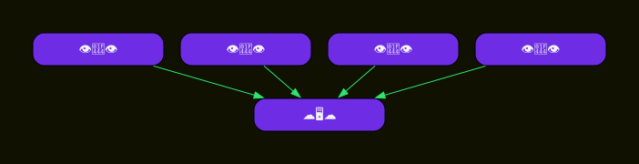
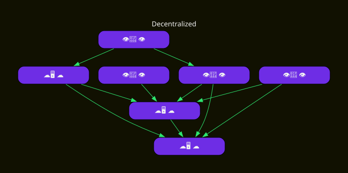
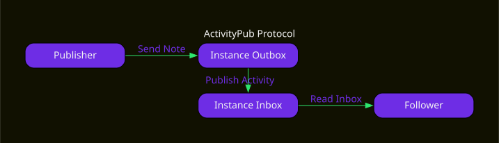
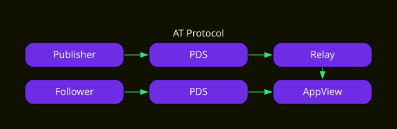
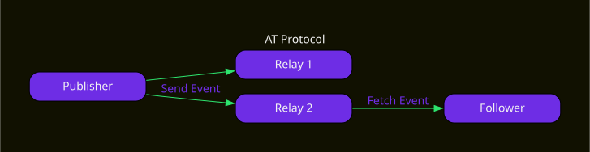
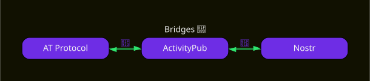
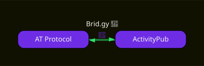
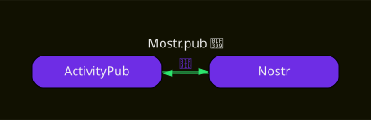

# Decentralized Social Media: What is it, how does it work?

This post will introduce you to the concept of decentralized social media and go over the tradeoffs between ActivityPub, AT Protocol, and Nostr. It's geared for a semi technical audience and was adapted from a [talk](../slides/decentralized-social-media/) I did at ForwardJS Ottawa.

## What is it?

Despite the long title of the post the technology is actually pretty straightforward.
First lets take a look at Centralized social media platforms, or as you might know of them: social media platforms.

### Centralized Social Media

- Single "owner"
- Siloed data / users
- Closed / Gatekept APIs

Most social media platforms you use are owned by a single company. This company holds a silo with all data and captures all users and their connections to each other. This silo is either completely closed to third parties or gatekept behind APIs. These APIs cost money to use and the silo owners can decide to change or remove whenever they want regardless of what users or third parties (and users) might want. This is fine in general but it has some downsides. As an owner: the more data you have the more of a target you are for exploitation. And as a user you're at the whims of whoever currently owns the platform and have little to no agency. The centralized control is also a central point of failure and is inherantly fragile during instability (political, physical infra structure, etc).

### Decentralized

- Multiple "owners"
- Open Protocols
- Many implementations
- User choice
- It's like email

Decentralized social media works by getting rid of the single owner and spreading the ownership across a network. These platforms implement open protocols for servers to use to talk to each other between different implementations. So long as each server has enough overlap, they can transfer data between each other and present it to the user in a cohesive format. The result of this is user choice where they can choose the server and the type of implementation that suits them while still being able to interact with folks that have their own preferred servers. If this sounds like a lot, this is pretty much how email works. You register with a provider, and it figures out how to interact with other providers.

## Protocols

At the heart of decentralized social media are open protocols for how servers and clients should interact with each other.
Today I'll be going over three of the more popular ones, but theres loads more that I'm not covering today. If you want your favorite protocol to be added here, send me an email with your reasoning and we'll see what can be done.

### ActivityPub

- Instances
- Actors / Inboxes
- Activities

The one I personally use most is [ActivityPub](https://activitypub.rocks/). It works by having servers send `Activities` directed at `Actors` on other servers. An `Actor` is identified using a URL that resolves to some JSON with a field called `Inbox` which is a URL that other servers can send Activities to using an HTTP POST.
Users interact with each other by sending `Notes` to their instance with a `to:` field with URLs pointing at either specific Actors, their followers, or the public at large. Each activity has a unique `id` URL so that other instances can fetch a copy to verify it exists or fetch it when it's referenced elsewhere. When a user posts a new Activity, their instances will look up the relevant recipient Actors from the `to` field and will send the activity to their inbox using an HTTP POST. Inboxes will typically verify and validate the incoming data and add them to local databases to be able to run queries over the data as a whole. Recipients will then have APIs for reading through activities directed at them which can be specific to the sort of software they use. Communication is entirely based on HTTP Requests sending [JSON-LD](https://json-ld.org/) making implementations straightforward if you can figure out how to conform to the spec. What's neet is that totally different server software with totally different ways of representing user interfaces can enable their users to talk to each other by agreeing on a small set of standards.

#### Implementations

- [Mastodon](https://joinmastodon.org/)
- [PeerTube](https://joinpeertube.org/)
- [Pixelfed](https://pixelfed.org/)
- [Loops](https://loops.video/about)
- [Lemmy](https://join-lemmy.org/)
- [Distributed Press](https://distributed.press/)

The most popular server software that implements ActivityPub is called [Mastodon](https://joinmastodon.org/) which is a sort of twitter alternative. However there's other apps out there like [PeerTube](https://joinpeertube.org/) which is an alternative to YouTube. Another popular implementation is [Pixelfed](https://pixelfed.org/) which focuses on images with a similar interface to Instagram. [Loops](https://loops.video/about) is a recent addition which acts as an alternative to Tiktok or Vine. [Lemmy](https://join-lemmy.org/) gives a Reddit-like interface while distributing the moderation and groupings between different instances. I've personally worked on [Distributed Press](https://distributed.press/) which uses ActivityPub for adding comment sections to statically published websites.

Regardless of which implementation you're on, or which instance you join, you can interact with content published by folks on other instances and keep up to date with their new posts.

### ATProtocol

- [Personal Data Servers](https://atproto.wiki/en/wiki/reference/core-architecture/pds)
- [Relays](https://atproto.wiki/en/wiki/reference/core-architecture/relay) / Firehose
- AppViews

AT Protocol is a bit more complex with more moving parts to enable global views of the data in the network and to enable applications to create APIs for querying data without tying them to the users data storage directly. In AT Protocol all users have their data stored in their [Personal Data Server](https://atproto.wiki/en/wiki/reference/core-architecture/pds) (`PDS`). This data uses cryptographic signatures that enable subsets of it to be verified on their own without needing to fetch from a specific server each time. Unlike ActivityPub these proofs don't need to be checked with the origin PDS which decouples the data store from downstream applications. Data from PDSs is aggregated inside [Relays](https://atproto.wiki/en/wiki/reference/core-architecture/relay) which enables applications to consume feeds without having to fetch from each `PDS`. Most applications rely on a huge relay that collects the global state of the network called the [Firehose](https://atproto.wiki/en/wiki/reference/networking/firehose) which is managed by the company behind Bluesky. This data is then made available to downstream services called [AppViews](https://atproto.wiki/en/wiki/reference/core-architecture/appview) which can build indexes on subsets of the data and provide APIs for clients to query. These views can be anything from voting, event planning, and various shapes of social media. Clients will then talk to their PDS which will query AppViews on their behalf. Communication in ATProto is primarily facilitated with their [XRPC](https://atproto.com/specs/xrpc) RPC protocol which uses their custom schema language for defining APIs.

As a publisher you can choose to host your own PDS if you wish, and as an app user you can skip providing users accounts and focus on indexing data from the firehose and working on your UI.

#### Implementations

- [Bluesky](https://bsky.app/)
- [Blacksky](https://blackskyweb.xyz/)
- [NorthSky](https://northskysocial.com/)
- [SmokeSignal](https://smokesignal.events/)

The protocol has seen an explosion of activity over the past few years. A lot of the flashy developments seem to be at the AppView layer where new apps get made based on the global firehose, but there's also a load of personal data server implementations and efforts at non US relays being put together.

The main way you're likely to interact with the protocol right now is through BlueSky. It's kind of like twitter but with the ability to host your data on your own server and use your own website domain as your username.

[Blacksky](https://blackskyweb.xyz/overview/) is an independant community with their own implementations of AT Protocol software which is able into interoperate with the main Bluesky network. They focus more on serving marginalized communities with their own moderation and storage needs. [NorthSky](https://northskysocial.com) is a similar style app but with a goal of prioritizing safety for 2SLGBTQIA+ communities. It operates as a Canadian non profit worker cooperative which lets them focus on their communities needs over maximizing profitability. Another app is [SmokeSignal](https://smokesignal.events/) which is an event planner built on top of AT protocol. Finally, [Tangled](https://tangled.org/) is an alternative to Github for social coding. 

There's a load of other apps out there so I'd encourage you search around.

### Nostr

- Clients
- Events
- Relays
- Zaps

[Nostr](https://nostr.com/) (Notes and Other Stuff Transmitted by Relays) takes a different approach from the other two by prioritizing the client and making servers more simple. Clients create cryptographic key pairs which they use to sign individual `Events`. [Events](https://github.com/nostr-protocol/nips/blob/master/01.md#events-and-signatures) can be things like an update to your profile information, or a social media post, or whatever else. Nostr keeps a registry of [Nostr Improvement Possibilities](https://github.com/nostr-protocol/nips/tree/master) which define kinds of events that clients may support. These events can be sent to any Nostr relay and other clients can then fetch events of specific kinds or made by specific people. Any client can use any set of relays so long as they agree on the format of the messages being sent. The ecosystem also has a strong focus on cryptocurrency payments using the [bitcoin lightning network](https://en.wikipedia.org/wiki/Lightning_Network), aka [Zaps](https://nostr.how/en/zaps), to tip people or pay for services on marketplaces.

#### Implementations

- [Primal.net](https://primal.net/)
- [Holis.social](https://holis.social/)
- [dVine.video](https://divine.video/about)
- [shopstr.store](https://shopstr.store/)
- [Hashstr](https://hashstr.com/)

There's again quite a few apps and implementations. [Primal.net](https://primal.net/) is the most popular which is also a twitter alternative, this is where in addition to the like button you can send a few crypto coins (zaps) to somebody to show your appreciation. [Holis.social](https://holis.social/) is neat in that it's a service that makes tools for communities with a focus on community based crowd funding. They use the crypto stuff to enable communities to share funds to spend on shared resources and use nostr for the underlying data making it easy to self host or pay for hosting. [dVine.app](https://divine.video/about) is an alternative to Vine (and has some of the original Vine archive). [Shopstr](https://shopstr.store/) is a marketplace app. It uses cryptocurrencies for transactions and enables you to search from different relays without needing a central service for tracking them all. It builds on top of [NIP15](https://nostr-nips.com/nip-15) so people can use different apps and still be able to transact with each other. [Hashstr](https://hashstr.com/) is a cool idea which provides relays that only accept Notes tagged with specific [Geohash](https://en.wikipedia.org/wiki/Geohash) which makes it easier to focus on data specific to your geographic area.

## Tradeoffs

So! That was a lot. You might be wondering, what one of these should I use as a developer or user? Is there a single protocol that's the "best". The answer to that is "it depends". The protocols are different enough that depending on your use case you'll have a different "best"

### Onboarding

- 🔎 AP: Choose an instance ([ottawa.place](https://ottawa.place/))
- 📲 AT: Choose an AppView ([BlueSky](https://bsky.app/))
- 🌐 NOS: Choose an app and relays ([Primal](https://primal.net/))

One of the first tradeoffs users will face is how to actually use these platforms. In the case of ActivityPub you need to choose an instance. This determines the sort of people you'll be interacting with by default and it's good to search around to see if there's one that overlaps with your interest. If you're unsure, I'd suggest folks here hop onto [fedi DB](https://fedidb.com/) and search for communities related to your interests or where you live. For AT Protocol, your best bet right now is to hop onto [Bluesky](https://bsky.app/) or to search around for other app views. Unless you saw an existing appview you liked, I'd suggest sticking to the big one since you'll get the smoothest onboarding experience. Nostr also has a lot of options for apps and relays. If you're unsure you might as well start with [primal](https://primal.net/home) which is the most popular out of the box option.

Honestly all of these platforms have a lot of options to choose from so it can be hard to decide as someone new. The rule of thumb I'd give is to join places where you already know somebody and to start with the big instances then drill down to niches as you get to know what you like or dislike.

### Discoverability

- AP: Following, instance members/following
- AT: Global Firehose with filters 🔥
- NOS: Relays you send to

Once you have an account, who can see you and who you can see can be more nuanced. In the case of ActivityPub you'll see just the accounts you follow, and the accounts of folks on your instance and whatever all these folks boost onto your timeline. This can be confusing because if you have two instances blocking each other or nowhere near each others follow graphs you won't find posts from them on your instance unless you explicitly load their account or post. The benefit of this approach is that your social interactions have a higher level of shared context. The more focused your instance community is the more likely you are to have common points of interest. This applies to hashtag search too. Say you're a tech community that uses the XR tag to mean "mixed reality" instead of an activist community that mostly uses it to refer to extinction rebellion. Folks that overlap these spaces will still be equipped to judge the nuance based on who in the social graph is posting about what.

AT has a more traditional approach in that everything goes through the main firehose relay. This gives appviews a global view of all data and means that search won't miss things just because they're outside your social graph. This also means you have less shared context with any random post that is available to you, for better or worse.

In Nostr you have a similar situation to ActivityPub where the relays you interact with determine what you see. From what I've observed relays are more of a commodity though and an individual relay is less likely to hold a lot of social context. Your client app is responsible for pulling data and exposing it to the user in a way that makes sense.

### Privacy

- 🤫 AP: Instance-enforced 🔥
- 🥳 AT: All public (global)
- 👭 NOS: Public (relays) / Encrypted

Speaking of visibility, AT and Nostr both default to public posts.
AT protocol is fully public and globally so. Nostr has some support for end to end encrypted messaging but in general posts will be out on any relay you post them to for anyone to read. 

ActivityPub has a step up in that posts can be marked with levels of privacy like followers only or instance only or unlisted. This functionality lets you post things with a bit more privacy but it ultimately depends on all the instances you interact with to properly respect these settings. 

Like all online spaces you shouldn't post anything you wouldn't want read out loud in court or to your mother unless you're very confident in your operational security.

### Points of Failure

- AP: Your Instance
- AT: Firehose/Relays/AppViews/PDS
- NOS: Relays you use 🔥

In the centralized use case you usually have a central point of failure. If Google Plus takes its servers down for whatever reason, everyone loses access to their community at once.

In ActivityPub you get a bit more resilience in that other people's instances might go down, but once they're up again you'll resume synchronizing with them. Your main issue is that once your instance goes down, you personally can't participate anymore unless you make an account somewhere else.

AT protocol is a bit more complicated in that you have several different points of failure. If the firehose goes down none of the app views will see new posts but should have their existing ones. If an app view goes down others will still work and you'd still be able to pull from people's PDSs. If your PDS goes down you can't post but if someone else's goes down you can still see everything else.

Nostr has the most resilient model in that you can use as many relays as you want and if some of them go down you'd be fine so long as you can find more.

### Ownership

- AP: Instances own identity, can migrate
- AT: PDS own identity, can migrate
- NOS: Client owns identity, relay agnostic 🔥

Ownership of data is also an important consideration.

In Activitypub your identity is tied to a particular actor URL on a specific server. You can migrate your identity and keep your followers but it still ends up being a new identity.

AT is similar in that your PDS owns your identity due to having control over your cryptographic keys. You can migrate to a new PDS and efficiently copy all your data, but this will lead to a new keypair being created.

Nostr has an edge here in that it doesn't matter where your data is hosted since your client application has the keys you use for signing data.

In all of these cases if you have a custom DNS domain for your account it doesn't matter as much if you change where the underlying data lives so long as your followers see the update.

### Moderation

- AP: Instance, Fediblocking
- AT: AppView, Firehose, Blocklists
- NOS: Relay Spam Protection
- [roost.tools](https://roost.tools/): Off the shelf AI

Moderation can be tricky since there's no single authority deciding who can and cannot post on these platforms. In all these protocols users have the option to mute others and not see their content.

On top of that ActivityPub gives instance moderators the ability to moderate content on their local instance and to shield their users from other instances that might have lower moderation standards. Most instances use some sort of block list to avoid totally unmoderated servers that post hate speech or illegal content. The community uses the `#fediblock` hashtag to help admins learn about the current "meta" of who is more or less strict. For a more automated approach, [The Bad Space](https://tweaking.thebad.space/about) pulls blocklists from several instances and provides an API to get commonly blocked instances and reasons for them being blocked.

In AT protocol your appview shows you just the content it indexes. Past that, [blocklists](https://bsky.social/about/blog/03-12-2024-stackable-moderation) are a first class feature that users can follow and share with each other. Since bluesky holds the bulk of the users on the network and owns the firehose, their moderation approach has a strong effect on the network as a whole.

Moderation in Nostr seems to mostly be focused on removing illegal content or spammers from relays. The comunity in general is focused on maximizing freedom of speech so you're less likely to see hate speech taken down and would need to deal with it at the client level.

Lastly I wanted to mention roost.tools which is a platform for off the shelf AI powered moderation that folks can integrate into their servers without needing to invest in full time staff. AI moderation can be problematic with false positives especially for keywords related to LGBTQ specific language, but it can be better than having absolutely nothing and good enough if your requirements align with the model.

### Culture

- AP: Nerds, Furries, 2SLGBTQIA+
- AT: Twitter Exodus
- NOS: Bitcoin, Freedom of speech

Lastly I wanted to talk a bit about the vibes. All these platforms have all sorts of people but there are definitely some dominant cultures on each.

ActivityPub has a lot of nerds on it, mostly tech but folks with strong niche interests in general have a good time there. Ther's also a lot of furries since they already run internet infrastructure. A lot of instances also focus on being safe spaces for queer folks due to them being deplatformed a lot on mainstream social media.

AT proto and Bluesky in particular seems to be accumulating folks that are ditching twitter and the vibes are similar to pre covid twitter in that regard. It's of course got niche people on it as well but in general it's more friendly to what you'd expect from mainstream spaces. Blacksky in particular provides space for people of color to find community, similar to how [Black Twitter](https://en.wikipedia.org/wiki/Black_Twitter) functioned before the site got sold and the overall culture shifted.

Nostr is primarily housing folks that are interested in Bitcoin and has a strong focus on freedom of speech. If you're interested in playing with monetization strategies or into those things this is where you'll get the best experience.

I will say these are my totally subjective views on the spaces and there's a lot of nuance I'm not getting into so your experience may vary. Regardless of the protocol, you always have the option of building your own communities with whatever culture you wish to bring.

## Bridges

Since all of these protocols are open at the core there's an ecosystem of bridges which convert from one network to another. This is possible thanks to open standards and not having access gatekept by APIs with complicated oauth setups and tight restrictions.

### Brid.gy

One of the more recent and in my opinion most useful ones is the [brid.gy](https://brid.gy/) bridge between ActivityPub and Bluesky. ActivityPub accounts can follow the bridge from their side and have an AT Protocol account created which mirrors all their posts. BlueSky users can do the same from their side to have an ActivityPub account created for any ActivityPub instance to interact with. The author of this tool took great care to ensure user consent on both sides so that people that don't explicitly want to be bridged won't be.

### Mostr

An older bridge is [Mostr](https://mostr.pub/). It acts as a Nostr relay and an ActivityPub instance. Unlike bridgy it automatically creates bridged accounts when somebody attempts to search for an account from either side. This makes it easier to follow whoever you want but also means that users that don't want to be bridged have to take the extra step of blocking Mostr. Mostr has also been enabling ActivityPub users to receive Zaps if they link their wallet in their public metadata.

### 🤷 So what? 🫨

So! That was a lot to cover. Hopefully you now have a feeling for what decentralized social media is, and how the protocols behind it work. I think the first thing you could do is join one of these networks and try them out. And next time you plan to build a new app that uses social features, I hope you can consider building on an open foundation so that instead of silos locking others out we can have more communities building each other up.

## Thank you!

---

Last Updated on January 2026 by Mauve Signweaver