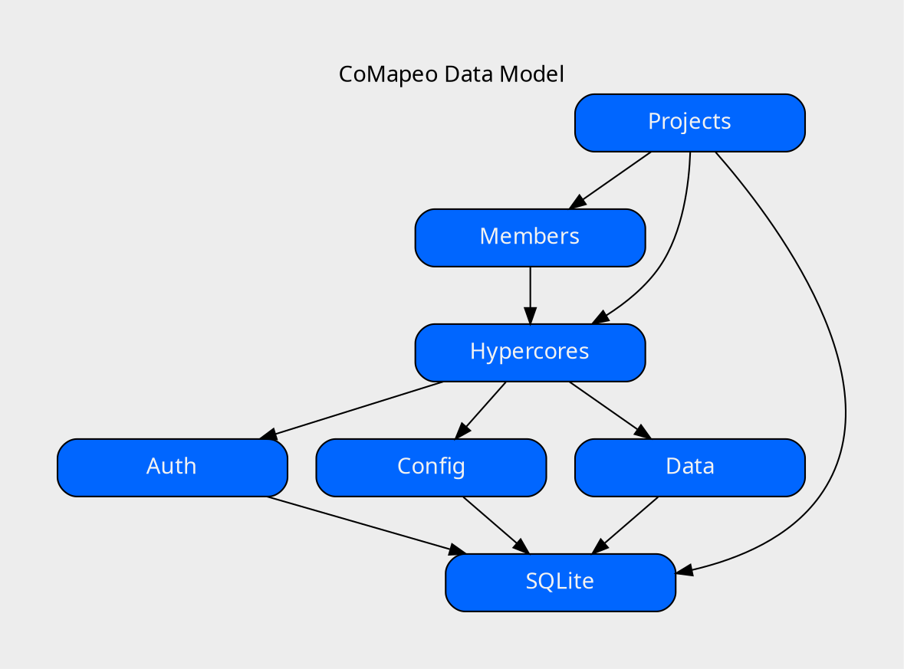
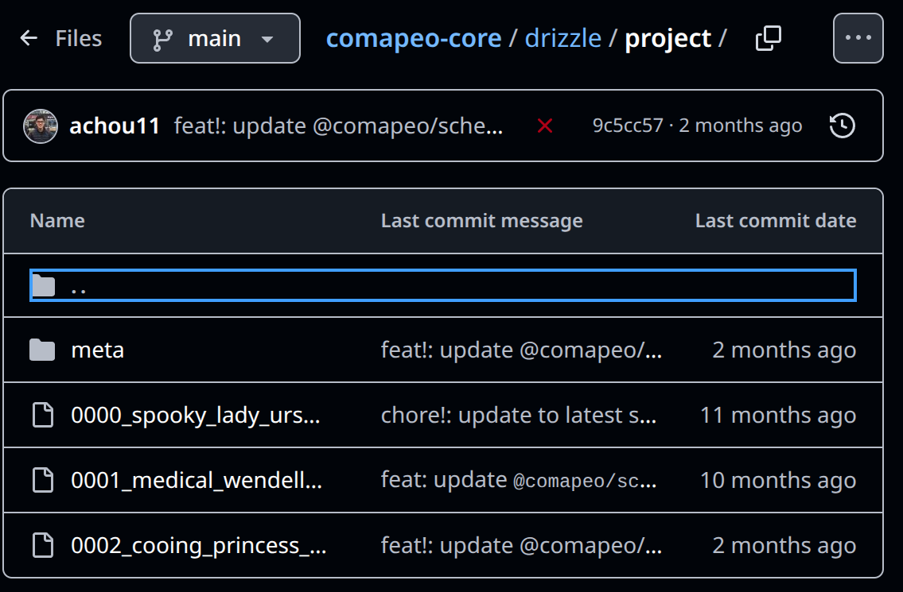
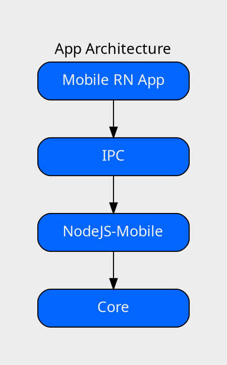
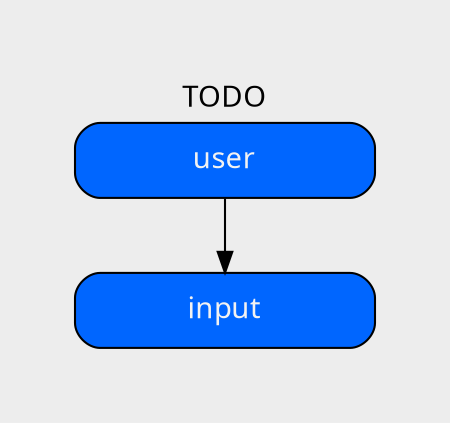

# Peer To Peer Mapping with CoMapeo

TODO: CoMapeo Logo
TODO: CoMapeo color scheme

???

Hey folks, today I'll be talking about how we do peer to peer mapping in the amazon with Comapeo.
I'll talk a bit about the app and why we use peer to peer, and then I'll go into how our approach at the data and networking layer.

---

## The App

- Offline Maps
- Observations/Tracks
- Preset categories

TODO: Screenshot of comapeo

???

Comapeo is used by indigenous groups around the world to document their land.
Communities can place markers on maps and attach images or text.
This can then be used by communities as evidence against illegal logging or to petition their government regarding land use.

---

## Why P2P?

- Offline-First
- Mobile Hotspots
- Intermittent connectivity

???

Since we're serving people in remote areas, an always online cloud first approach just doesn't cut it.
We wanted folks to be able to start without needing internet at any step of the process.
Folks can start saving data while they're out on their land, and eventually they can meet up with others to either sync directly via mobile hotspots, or via more permenant wifi infrastructure.
Our sync protocol also had to be able to handle intermittent connectivity and breaks during the replication process.

---

## The Data Model

???

At the core of our data model are Hypercores. Append only logs with public keys allowing verification of data, and a fancy merkle tree that allows fast sparse replication with bitfields.
We use them to track state in projects.
Users create a hypercore to represent the project, and then assign roles to new members which get picked up to determine sync and write permissions.
All this data is indexed into local sqlite tables which act as views over raw events.

---

## Versioning

???

One important edge case for us is versioning and ensuring backwards and forwards compatibility in the app.
We often have folks with mismatching versions out in the field because automatic updates over the internet are not available, so we needed to account for this from the get go.
For this we use a combination of the drizzle ORM for doing schema migrations and a versioned moddule of JSON Schema and protocol buffer equivalents.
Whenever the app needs to migrate to a new version it will rebuild its local tables to ensure that any new or removed fields get tracked.

---

## Security Model

- Capabilities
- NOISE handshake
- "Auth cores"

???

For security we make use of capability systems.
The on-the-wire protocol uses noise handshakes which let us know whose public key is on the other side.
Projects will share cryptographic keys for new members to be able to participate, and coordinators will add new members cores with restrictions on the kind of data they're allowed to read and write.
When a peer tries to replicate with another, they'll only allow the other side to replicate data based on the permissions assigned to them.
For example, full members may write their own data but cannot overwrite the data of others. Peers that know the project keys but whose role we haven't synced yet can attempt to replicate auth cores but nothing else.

---

## App Architecture

???

To maximize code reuse we're using React Native for our front end and keep the bulk of our peer to peer logic inside a nodejs-mobile worker that we communicate with over a custom IPC protocol.
With this we can keep core lean and reuse it across mobile, desktop electron, and our remote archive servers in the cloud.

---

## Peer Discovery

- Local TCP server
- System MDNS
- Port reuse

???

For connections between peers, we use a local TCP server and defer to the system Multicast DNS provider.
We use a random port on app load, but we reuse the port from then on to avoid edge cases in MDNS caching.
Once a peer goes online, they announce themselves on the network, and other peers will attempt to connect to them.
We deduplicate connections based on the NOISE public key, and hand off the connection to Hypercore's replication protocol for checking capabilities and initializing core sync.

---

## What's next?

- [Refining Desktop](https://github.com/digidem/comapeo-desktop/)
- [MCP API for AI](https://github.com/digidem/comapeo-cloud-client/blob/ce10b8c08f21762bf98e384d76389f1cdb7b586d/src/mcp.js#L13)
- Data Sovereignty Toolkit

???

So! That's how the peer to peer side works and some of the reasons for why we took the path we did.
We're currently refining our desktop app and in the near future we've been talking about making project data available to AI via the Model Context Protocol, and we're looking to refactor our code to make it generally available as a data sovereignty toolkit that other projects can build upon.

---

## Thank you!

- [CoMapeo-Core](https://github.com/digidem/comapeo-core)
- [Awana Digital Discord](https://discord.com/channels/910147496842518539/910153227671068742)

---

## Template

