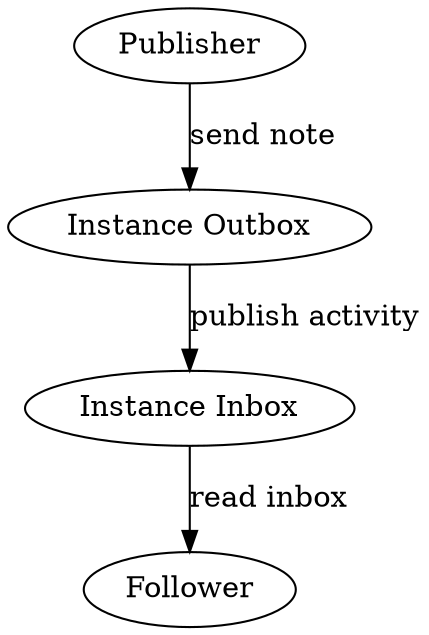
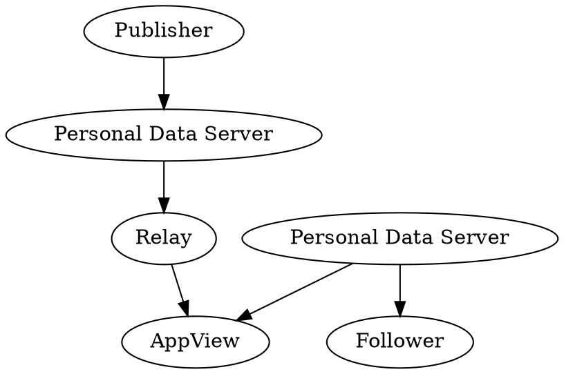
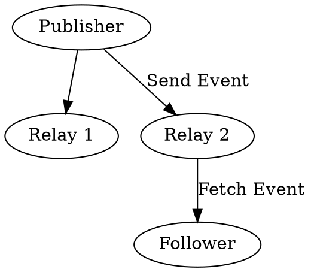
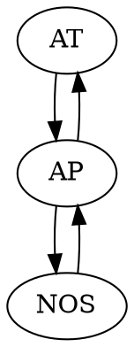
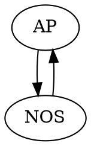

# Decentralized Social Media: What is it, how does it work?

## Why is it?

### Centralied Social Media

## Protocols

### ActivityPub

#### Protocol

- Instances
- Actors / Inboxes
- Activities

ActivityPub works by having servers talk to each other by exchanging activities directed at Actors.
An Actor is identified using a URL that resolves to some JSON with a field called Inbox which is a URL that other servers can send Activities to using an HTTP POST.
Users talk to each other by sending notes to their instance with a to field to either specific users, their followers, or the public at large.
Each activity has a unique URL so that other instances can fetch a copy to verify it exists or get updates.
Their instances will then look up the inboxes of the relevant actors and deliver the activity.
Inboxes will typically verify the incoming data and add them to local databases to provider users the ability to search through all the data.
Recipients will then have APIs for reading through activities directed at them which can be specific to the sort of software they use.
Communication is entirely based on HTTP Requests sending JSON-LD making implementations straightforward if you can figure out how to conform to the spec.
What's neet is that totally different server software with totally different ways of representing user interfaces can enable their users to talk to each other by agreeing on a small set of standards.

#### Implementations

- Mastodon
- PeerTube
- Distributed Press

The most popular server software that implements ActivityPub is called Mastodon which is a sort of twitter alternative.
However there's other apps out there like PeerTube which is like a YouTube alternative.
I've personally worked on Distributed Press which uses ActivityPub for adding comment sections to statically published websites.
Regardless of which sort of implementation you're on you can interact with content published by folks on other instances and keep up to date with their new posts.

### ATProtocol

#### Protocol

- Personal Data Servers
- Relays / Firehose
- AppViews

AT Protocol is a bit more complex with more moving parts to enable global views of the data in the network and to enable applications to create APIs for querying data without tying them to the users data storage directly.
In AT Protocol all users have their data stored in their Personal Data Server.
This data uses cryptographic signatures that enable subsets of it to be verified on their own without needing to fetch from a specific server each time.
Unlike ActivityPub these proofs don't need to be checked with the origin PDS which decouples the data store from downstream applications.
Data from PDSs is aggregated inside Relays which enables applications to consume feeds without having to fetch from each PDS.
Most applications rely on a huge relay that collects the global state of the network called the Firehose which is managed by the company behind Bluesky.
This data is then made available to downstream services called AppViews which can build indexes on subsets of the data and provide APIs for clients to query.
These views can be anything from voting, event planning, and various shapes of social media.
Clients will then talk to their PDS which will query AppViews on their behalf.
Communication in ATProto is primarily facilitated with their XRPC RPC protocol which uses their custom schema language for defining APIs.
As a publisher you can choose to host your own PDS if you wish, and as an app user you can skip providing users accounts and focus on indexing data from the firehose and working on your UI.

#### Implementations

- [Bluesky](https://bsky.app/)
- [SmokeSignal](https://smokesignal.events/)
- [NorthSky](https://northskysocial.com/)

### Nostr

#### Protocol

- Clients
- Events
- Relays
- Zaps

Nostr is takes a different approach from the other two by prioritizing the client and making servers more simple.
Clients create cryptographic keypairs which they use to sign individual Events.
Events can be things like an update to your profile information, or a social media post.
These events can be sent to any Nostr relay and other clients can then fetch events of specific kinds or made by specific people.
Any client can use any set of relays so long as they agree on the format of the messages being sent.

#### Implementations

- [Primal.net](https://primal.net/)
- [Holis.social](https://holis.social/)

## Tradeoffs

### Onboarding

- AP: Need to find an instance
- AT: Choose an AppView (bluesky?)
- NOS: Choose an app and relays

### Discoverability

- AP: Who you follow and their boosts, other folks on the network
- AT: Global Firehose with filters
- NOS: Relays you talk to

### Privacy

- AP: Instance-enforced
- AT: All public
- NOS: All Public

### Points of Failure

- AP: Your Instance
- AT: Firehose/Relays/AppViews/PDS
- NOS: Relays you use

### Ownership

- AP: Instances own identity, can migrate
- AT: PDS own identity, can migrate
- NOS: Client owns identity, Send your events to any relay

### Moderation

- AT: AppView, Firehose
- AP: Instance, Fediblocking
- NOS: Relays

### Culture

- AT: Twitter Exodus
- AP: Nerds, Furries, 2SLGBTQIA+
- NOS: Bitcoin, Freedom of speech

## Bridges

Since all of these protocols are open at the core there's an ecosystem of bridges which convert from one network to another.
This is possible thanks to open standards and not having access gatekept by APIs with complicated oauth setups and tight restrictions.

### Brid.gy

One of the more recent and in my opinion most useful ones is the bridgy bridge between ActivityPub and Bluesky.
ActivityPub accounts can follow the birdge from their side and have at AT Protocol account created which mirrors all their posts.
BlueSky users can do the same from their side to have an ActivityPub account created for any ActivityPub instance to interact with.
The author of this tool took great care to ensure user consent on both sides so that people that don't explicitly want to be bridged won't be.

### Mostr

An older bridge is Mostr. It acts as a Nostr relay and an ActivityPub instance.
Unlike bridgy it automatically creates bridged accounts when somebody attempts to search for an account from either side.
This makes it easier to follow whoever you want but also means that users that don't want to be bridged have to take the extra step of blocking Mostr.
Mostr has also been enabling ActivityPub users to receive Zaps if they link their wallet in their public metadata.
