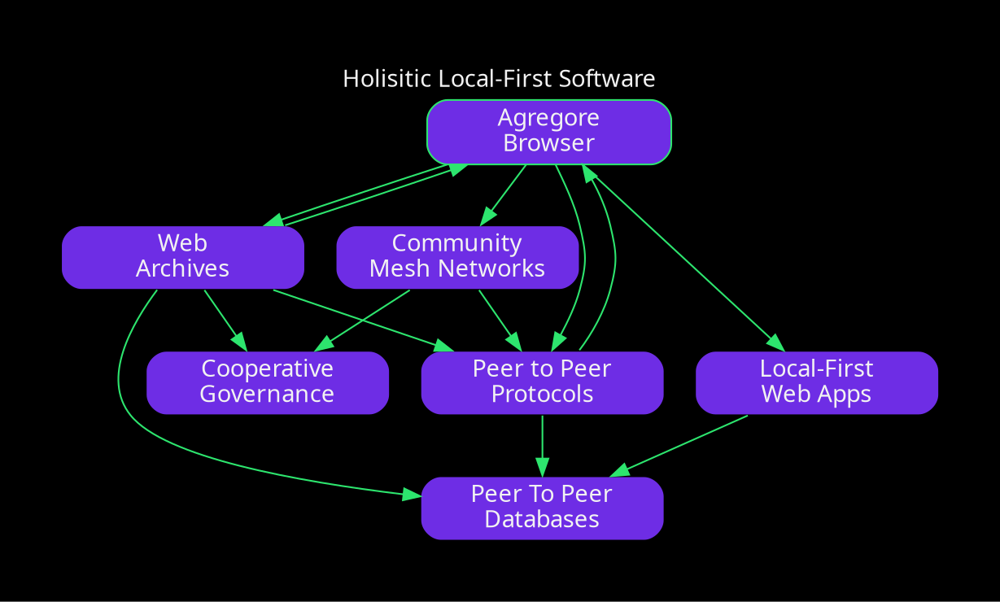
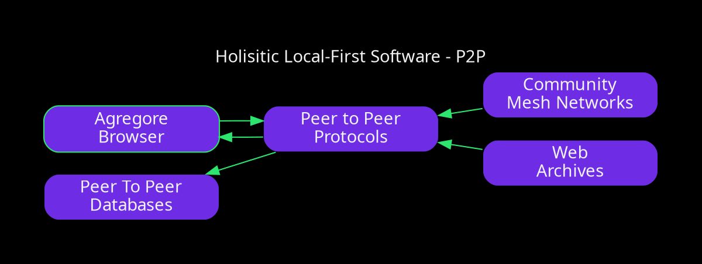
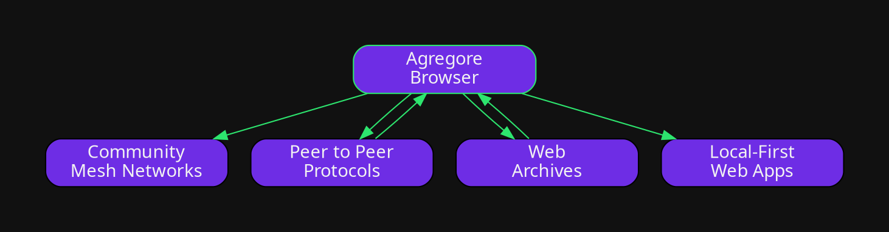
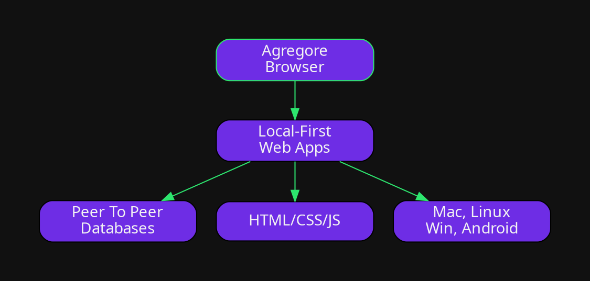
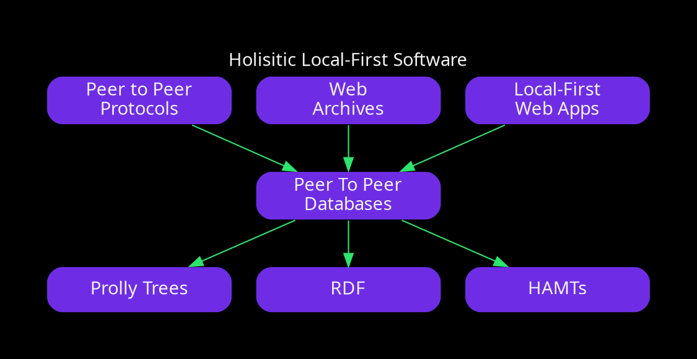
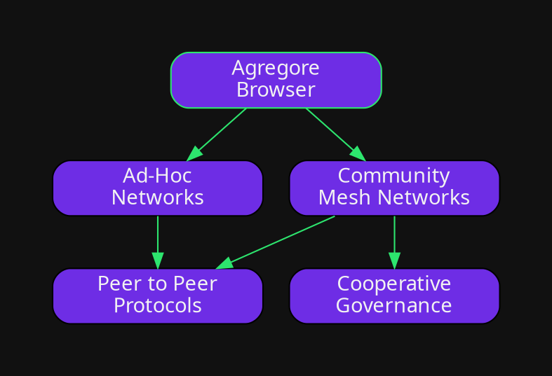
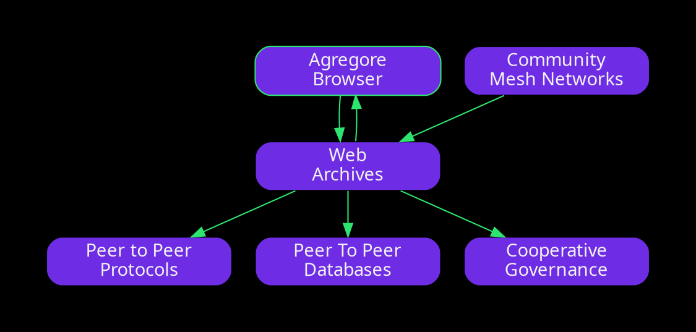
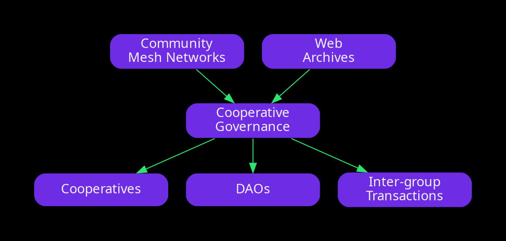

# Holistic Local-First

???

Thanks for coming out!
My name is Mauve,
my pronouns are they/it,
and today I'm going to be talking about my vision for Holistic Local-First Technology.
Today we're going to be looking at the very high level and not getting too much into the technical details

Just a heads up, my opinions and plans are my own and don't represent the stances of the folks I work with.

---

## What are the parts?

So, there's a few bits that fit together for my vision.
There's the Agregore Browser,
Peer to Peer Protocols,
Peer to Peer Databases,
Community Mesh Networks,
Web Archviing,
and Cooperative Governance.

Here's a graph of how it all fits together, but before we get too overwhelmed lets break it down piece by piece.

---

## Peer To Peer Protocols

At the core of my conception for local-first software is relying on peer to peer networking protocols.

Think of these as alternatives to the HTTP based web that we see in our web browsers and cloud services now.

Instead of storing everything in the cloud and under the control of a corporation, you can store it on your computer and exchange data with others directly.

This reduces the need to depend on always-online cloud services which usually get in the way of making things work offline and without a monthly fee for upkeep.

---

## Agregore

The next important bit for me is how to expose these protocols to people in a way where they can build local-first apps without too much extra setup.

This is were Agregore comes in. It combines loading and publishing to p2p protocols natively and enables people to use basic HTML, CSS, and JavaScript to interact with them without needing to install extra build tools or worry about cross platform app distribution.

This is how you can load any content on p2p networks and load local-first web apps.

It's pretty much the "user facing" portion of the stack.

---

## Local-First Web Apps

So, there's a bunch of ways to do "local-first" apps, but I'd like to focus on the web apps you can make with Agregore.

What's interesting from other approaches is that the app becomes just another bit of data that you can load and create within Agregore.

You can author your app with just the bits of the UI you need, and know that you can load it on Mac, Windows, Linux, and Android and just need to account for different screen sizes.

We're currently working on some educational materials that build off of existing web dev and tech literacy concepts and add this new bit of p2p magic which lets people skip having to learn "the back end".

---

## Peer To Peer Databases

P2P and Agregore on their own aren't enough to make these apps viable.

An important portion which I feel hasn't been getting enough attention is how to get data to load as fast as possible.

Right now a lot of apps rely on fully synchronizing all your data before it can be usable, but with some new structures we can have our p2p data be indexed so that you can load just the bits necessary for your current view and skip loading all the rest.

This is what the new IPLD Prolly Tree spec is used for along with some other things out there like HAMTs and existing search indexes.

This is also where we should be looking more at standards for linked data so that more information can be interoperable without everybody reinventing the wheel all the time.

---

## Community Mesh Networks

One of the things that gets in the way of fully local-first setups is that a lot of folks are stuck relying on centralized infrastructure set up by for-profit Internet Service Providers.

An alternative can be seen in communities which set up their own network infrastructure by gluing stuff together or setting up wireless connections over long distances.

What's interesting is that with p2p protocols we can start taking more advantage of the physical topology of our networks so that we can prioritize loading data from devices nearby and caching data within the network itself.

For example, if you and I are beside each other, we should be able to share videos right between our devices instead of needing to reach out to a cloud server somewhere in the USA.

Along these lines, Agregore on Android has been experimenting with making it easy to build up a local mesh network just using your devices by dynamically creating and connecting to wifi hotspots on your devices.

---

## Web Archives

However, it's important not to be too utopian and to figure out how to transition to using these tools from what we have right now.

Web Archiving could be a path to bridging existing web content with the peer to peer content local to a mesh.

Tools like WebRecorder's Browsertrix Cloud could be run locally on the mesh by the community so that web pages could be pulled down into an archive once, and then shared over the local network with users.

This would enable us to carry around archives between communities and save on the overall bandwidth needed to load data.

WebRecorder is currently working on new optimizations for their WACZ archive format so that resources within archives can be agressively deduplicated at the p2p protocol layer as they're being loaded.

This is also were cooperatively run search indexes could come in handy so that groups could pool large amounts of information together and search through it without needing to rely on Google's cloud infrastructure and with the search results being available for offline use.

## Community Governance

Getting all of this stuff to work without people being exploited at every step of the way requires us to be careful about how we cooperate with other groups and with individuals.

This is where cooperative governance either via traditional Worker or Consumer cooperatives, the shiny new Decentralized Autonomous Organizations, or with folks working togehter as equals while figruing out their formal structures.

We should also be working towards inter-group interactsions for folks that consider this approach important.

This might mean joining in to build tools together, enabling inter-chain tokenomics between localized economies, or prefering to transact with other cooperatively owned businesses.

At the end of the day this is actually the hardest bit to figure out since the realtionships we build will influence how infrastructure can be used and vise versa.

---

## Let's Build Together

- Looking for: Funding, Collaborators, Educators, Developers
- mailto:contact@mauve.moe
- https://agregore.mauve.moe

???

So that's the gist of it.
Next steps are to make it a reality, and for that we need to start working together.
Specicifically we need to figure out how to fund all this work, who's interested in building and deploying this stuff, and how we can make it accessible to people to build on top of.

If this is up your alley, send me an email or come hop into one of the chats linked to at the bottom of the Agregore website.
