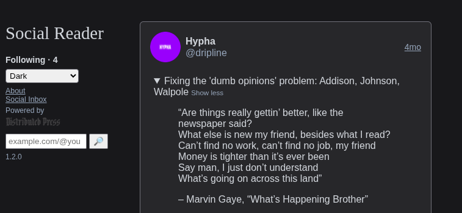

<style>
@font-face {
  font-family: 'FontWithASyntaxHighlighter';
  src: url('FontWithASyntaxHighlighter-Regular.woff2') format('woff2');
}

:root {
  --diagram-primary: #6e2de5;
  --diagram-secondary: #2de56e;
  --diagram-bg: #111111;
  --diagram-text: #F2F2F2;
  --diagram-bg-alt: color-mix(in srgb, #6e2de5 15%, #111111);
}

pre code {
  background: var(--diagram-bg-alt);
  padding: 0.75em 1em;
  border-left: 3px solid var(--diagram-primary);
  display: block;
  font-family: 'FontWithASyntaxHighlighter', monospace;
  font-size: 0.85em;
}

table {
  border-collapse: collapse;
  margin: 1em auto;
}

th,
td {
  border: 1px solid var(--diagram-primary);
  padding: 0.4em 0.6em;
  text-align: left;
}

thead th {
  background: var(--diagram-primary);
  color: var(--diagram-text);
  font-weight: bold;
}

tbody td:nth-child(1) { background: var(--diagram-bg-alt); font-family: monospace; color: var(--diagram-secondary); }
tbody td:nth-child(2) { background: color-mix(in srgb, var(--diagram-primary) 10%, var(--diagram-bg)); }
tbody td:nth-child(3) { background: color-mix(in srgb, var(--diagram-secondary) 10%, var(--diagram-bg)); }
tbody td:nth-child(4) { background: color-mix(in srgb, var(--diagram-primary) 20%, var(--diagram-bg)); }
tbody td:nth-child(5) { background: color-mix(in srgb, var(--diagram-secondary) 20%, var(--diagram-bg)); }

dl {
  display: grid;
  grid-template-columns: auto 1fr;
  gap: 0.25em 1em;
  padding: 0.5em;
}

dt {
  color: var(--diagram-secondary);
  font-family: 'FontWithASyntaxHighlighter', monospace;
  font-weight: bold;
}

dd {
  background: var(--diagram-bg-alt);
  padding: 0.3em 0.6em;
  border-radius: 4px;
  font-family: 'FontWithASyntaxHighlighter', monospace;
  font-size: 0.85em;
}

ul {
  list-style: none;
  padding-left: 1.5em;
}

ul::before {
  content: "";
  position: absolute;
  left: 0;
  top: 0;
  bottom: 0;
  width: 2px;
  background: var(--diagram-primary);
}

li {
  position: relative;
  padding-left: 1em;
  margin: 0.25em 0;
}

li::before {
  content: "├─";
  position: absolute;
  left: 0;
  color: var(--diagram-primary);
}

li:last-child::before {
  content: "└─";
}

strong { color: var(--diagram-secondary); }
em { color: var(--diagram-primary); }
</style>

# How to use the web's built in Database, IndexedDB

???

This talk will introduce folks to IndexedDB. We'll go over how it holds data, how to search through data, and how you need to effectively manage indexes to keep your app fast. We'll also look at some real life open source projects that use this for offline-first apps.


My name is Mauve Signweaver, I'm a decentralized software consultant, and I'm a bit of a database nerd. Thanks for coming out to learn today!

---

## Overview

- Databases (relational, document)
- IndexedDB (data model, api, migration)
- Performance: (indexing, iteration)
- Real world: Social Reader

???

So, First we'll get on the same page about how databases w2ork.
Then we'll take a look at IndexedDB, how it models data, and a look at how to use it's API and deal with database migrations.
Then we'll talk a bit about how to improve your app performance.
And we'll wrap up by looking at how an open source app I've worked with in the past uses it for offline social feeds.

---

## Databases

Diagram: SQL statement referencing bobby tables

<pre><code>SELECT * FROM users WHERE name = ';
  DROP TABLE students; --';</code></pre>

???

Back end developers are used to relying on databases for storing and sorting through large amounts of data. Usually anything you see on a website needed to be entered into a large database somewhere and fetched before you can see it on the page. These can get really big and end up being a bottleneck and point of centralization in your apps. Thankfully that means job security for those of us that know how to keep them going.

---

### Relational Databases 📂

Diagram: SVG table with generic user data

| id | name  | email               | age | role      |
|----|-------|---------------------|-----|-----------|
| 1  | Alice | alice@example.com   | 30  | admin     |
| 2  | Bob   | bob@example.com     | 25  | user      |
| 3  | Carol | carol@example.com   | 28  | user      |
| 4  | Dave  | dave@example.com    | 35  | moderator |

(e.g. MySQL, Postgres)

???

Most folks use some flavor of relational database with predefined fields in rows of tables.
Before you can store data you need to figure out it's shape and how different rows will reference each other.

---

#### Migrations ➡️

Diagram: SQL statement adding a new varchar `sin` field to the users table with the default set to "existing"

<pre><code>ALTER TABLE users
  ADD COLUMN sin VARCHAR(10)
  DEFAULT 'existing';</code></pre>

???

If you want to add a new field to your data, you need to update the schema and often perform a migration over all your data before you can resume reading and writing.

---

#### Disk format 📀

Diagram: color coded hex for three rows of hex numbers with four repeating colors for colums.

| offset | col 0                   | col 1                   | col 2                   | col 3                   |
|--------|-------------------------|-------------------------|-------------------------|-------------------------|
| 0x00   | `41 6C 69 63 65 00 30 FF` | `42 6F 62 00 00 19 FF 00` | `43 61 72 6F 6C 00 1C FF` | `44 61 76 65 00 23 FF 00` |
| 0x20   | `65 78 69 73 74 69 6E 67` | `75 73 65 72 00 00 00 FF` | `6D 6F 64 00 00 00 FF 00` | `61 64 6D 69 6E 00 FF 00` |
| 0x40   | `00 00 00 00 FF FF FF FF` | `41 6C 69 63 65 00 30 FF` | `42 6F 62 00 00 19 FF 00` | `00 00 00 00 FF FF FF FF` |

???

The benefit here is that the on disk representation of your data can be a lot more predictable with individual rows having periodic offsets. Instead of needing to sift and parse all the data, the database can quickly skip rows or read just the bytes for specific colums.

There's a load of nuance here so bear with me if you're an expert on database internals.

---

### Document Stores 📄

Diagram: List of JSON objects of users, different fields exist in each. Each has an ID

| _id   | Document                                                           |
|-------|--------------------------------------------------------------------|
| doc1  | `{ "name": "Alice", "email": "alice@example.com", "age": 30, "role": "admin" }` |
| doc2  | `{ "name": "Bob", "email": "bob@example.com", "preferredColor": "blue" }`        |
| doc3  | `{ "name": "Carol", "age": 28, "tags": ["user", "moderator"], "bio": "hi!" }`   |
| doc4  | `{ "name": "Dave", "role": "moderator" }`                                 |

(e.g. MongoDB, CouchDB)
???

Another popular style of database is the document store. Instead neatly uniform tables, you can essentially have a bunch of json documents which can have heterogenous shapes. What data type or whether a field exists is totally up to you so long as your application can handle it. The only thing that really matters is to have unique identifiers for each document so you can reference them for updates and deletion.

This can be nice if you have complex shapes for your data or don't want to mess with schemas on the database side and plan to handle it in your application layer instead.

---

#### Key Value Stores 🗝️

Diagram: Key value pairs with ids pointing to json documents

- `"doc1"` → `{ "name": "Alice", "age": 30, "role": "admin" }`
- `"doc2"` → `{ "name": "Bob", "preferredColor": "blue" }`
- `"doc3"` → `{ "name": "Carol", "tags": ["user"] }`
- `"doc4"` → `{ "name": "Dave", "role": "moderator" }`

???

Since the binary representation of documents can't be as uniform, most dbs end up storing the raw data in key value stores and doing a bit more parsing when running queries. The keys end up being the thing that makes seeking through the data quick using B+ trees to speed up random access and iteration.

---

## 🎉 IndexedDB 🥳

???

So! With that context let me introduce you to the star of the night, the only database that JavaScript developer have access to without needing really tricky libraries with experimental filesystem access: IndexedDB.

---

### Data model

Diagram: Tree hierarchy of a db called "my app" with two collections called posts and users and some "{}" representing data under each collection with ids like `doc1, doc2, docN` and an index labelled `byTime` for the posts

<ul>
  <li><em>"my app"</em>
    <ul>
      <li><strong>ObjectStore:</strong> "posts"
        <ul>
          <li>{}</li>
          <li>{}</li>
          <li><em>Index: byTime ↕</em></li>
        </ul>
      </li>
      <li><strong>ObjectStore:</strong> "users"
        <ul>
          <li>{}</li>
          <li>{}</li>
        </ul>
      </li>
    </ul>
  </li>
</ul>

???

Indexed DB is a document store. Your app can have one or more named databases that are shared between all web pages on your domain. These databases have named collections of documents (they call them object stores) and indexes over those collections that speed up searching.

---

### API

```JavaScript
const db = await new Promise((res, rej) => {
  const r = indexedDB.open("my app", 1);
  r.onupgradeneeded = e => e.target.result.createObjectStore("posts", { keyPath: "id", autoIncrement: true });
  r.onsuccess = () => res(r.result);
  r.onerror = () => rej(r.error);
});

// Save
const tx1 = db.transaction("posts", "readwrite");
tx1.objectStore("posts").add({ title: "Hello", body: "World" });
await tx1.complete;

// Get by id
const tx2 = db.transaction("posts", "readonly");
const post = await new Promise((res, rej) => {
  const r = tx2.objectStore("posts").get(1);
  r.onsuccess = () => res(r.result);
  r.onerror = () => rej(r.error);
});
```

???

This is the gist of what the API looks like. You need to explicitly open your db and any operations require starting a transaction which has this weird callback pattern because it was finalized before promises were a thing. One thing to note is that unlike LocalStorage which some of you may have used to store small bits of data, the entire api is asynchronous which is good for keeping your render thread speedy, but requires you to be careful with asynchronous actions happening concurrently. These transaction objects help the different tabs in your app coordinate read and write operations without stepping on each other and causing conflicts. 

---

### IDB.js

```JavaScript
import { openDB } from 'idb';

const db = await openDB('my app', 1, {
  upgrade(db) {
    db.createObjectStore('posts', { keyPath: 'id', autoIncrement: true });
  },
});

// Save a post
await db.add('posts', { title: 'Hello', body: 'World' });

// Get by id
const post = await db.get('posts', 1);

// Get all posts
const allPosts = await db.getAll('posts');
```

All that code adds up though so instead of writing a bunch of onsuccess callbacks, we'll assume that your app is using this super lightweight wrapper called IDB.js.

This handles wrapping transactions in promises and converts the custom iterator api into more familiar async iterators.

Notice here how we set up a default key for all posts called `id` and have the database track automatically assigning them when we add a new document. You can also choose to set the key to a field that you control at the app layer and can set to a string instead of an integer.

---

### CRUD

```JavaScript
// Create
const id = await db.add('posts', { title: 'Hello', body: 'World' });
// Read
const post = await db.get('posts', id);
// Update
await db.put('posts', { ...post, body: 'Updated!' });
// Delete
await db.delete('posts', id);
```

???

Just as you'd expect with any other data store you have some basic operations for creating, reading back, updating, and deleting. Note that usually you'd need to set up transactions and perform the operations on there, but thankfully, IDB.js gives us more concise wrappers that open the store and transaction for you.

---

### Why not LocalStorage?

```JavaScript
const store = 'posts';
// Create
const id = Date.now();
localStorage.setItem(`${store}:${id}`, JSON.stringify({ title: 'Hello', body: 'World' }));
// Read
const post = JSON.parse(localStorage.getItem(`${store}:${id}`));
// Update
localStorage.setItem(`${store}:${id}`, JSON.stringify({ ...post, body: 'Updated!' }));
// Delete
localStorage.removeItem(`${store}:${id}`);
```

???

At this point you might be thinking, why not just use LocalStorage? Sometimes, localStorage is really enough if you just have a bit of data to save.
Where it breaks is when you start reading and writing very frequently or need to deal with large numbers of data.
I also just find the fact that you need to convert to and from JSON strings kind of annoying and prefer to use raw objects.

---

### Iterating

```JavaScript
for await (const { value } of db.transaction('posts').store) {
  if (value.year === new Date().getFullYear()) {
    console.log('This year:', value);
  }
}
```

???

Similarly, we can easily iterate through all the documents in a collection using for await of syntax.
Now, notice here how I'm checking for posts that were tagged with the current year? This could make sense for rendering stuff to a calendar or some sort of gallary view in your app, but it's also hiding a major performance issue. Now, filtering through a few hundred posts is quick enough, but what if there are thousands, and what if you need them to be sorted? What we really need is to get an iterator with *just* this years posts and not bother loading the rest in the first place.

---

### Indexes

```JavaScript
const db = await openDB('my app', 1, {
  upgrade(db) {
    const store = db.createObjectStore('posts', { keyPath: 'id', autoIncrement: true });
    store.createIndex('year', 'year');
  },
});

const index = db.transaction('posts').store.index('year');
for await (const cursor of index.iterate(new Date().getFullYear())) {
  console.log(cursor.value);
}
```

???

This is exactly what indexes solve. You can specify a name, a field, and it will build up a sorted list of documents with that field. This way you can seek to a specific range

---

### Select in SQL

```sql
SELECT * FROM posts WHERE year = YEAR(CURRENT_DATE);
```

???

For reference this is how you could do the same thing in SQL.
Job security!

---

### What do they do, really?

Diagram: table with 1949 (Mao era) 1976 (Hua & Deng era) 1989 (Jiang era) 2002 (Hu era) 2012 (Xi era) representing key value pairs for the index

| Key  | Value         |
|------|---------------|
| 1949 | Mao era       |
| 1976 | Hua & Deng era|
| 1989 | Jiang era     |
| 2002 | Hu era        |
| 2012 | Xi era        |

???

Indexes build up an extra sorted list of key value pairs with the indexed value as the primary key, and the id of the document as a value.
The B+ tree used for storage gives you a quick way to seek to a particular value and iterate from there.

---

### Searching

```JavaScript
const index = db.transaction('posts').store.index('year');
const range = IDBKeyRange.bound(1922, 1991);
const range = IDBKeyRange.lowerBound(1980, true); // exclusive

for await (const cursor of index.iterate(range)) {
  console.log(cursor.value);
}
```

???

You can also use this for more advanced queries like values within a range or greater than a specific value.
Here we're finding just the things that were around during the USSR, and the things that only came into being after Regan got in power.

---

### Pagination

```JavaScript
const page = 2;
const pageSize = 10;

let cursor = await db.transaction('posts').store.openCursor();
cursor = await cursor.advance(page * pageSize);

while (cursor && posts.length < pageSize) {
  console.log(cursor.value)
  cursor = await cursor.continue();
}
```

???

Paging can be done by stepping outside of the iterator and  using the cursor API's advance and continue methods instead of for of loops. Advance lets you skip ahead a few entries and continue is how you manually progress to the next item.

---

### Migration

```JavaScript
const db = await openDB('my app', 3, {
  async upgrade(db, oldVersion, newVersion, tx) {
    if (oldVersion < 1) {
      const store = db.createObjectStore('posts', { keyPath: 'id', autoIncrement: true });
      store.createIndex('year', 'year');
    }
    if (oldVersion < 2) {
      tx.objectStore('posts').createIndex('author', 'author');
    }
    if (oldVersion < 3) {
      tx.objectStore('posts').createIndex('title', 'title');
    }
  },
});
```

???

Now, even though we don't need to modify documents when our application adds something, indexed db gives us a convenient way to create and update collections and indexes only if we haven't already. When our app tries to open a database, it can pass in a version number, and if the number is greater than what it was last time, it'll automatically call the upgrade function. Here you can have all the code you'll need to adjust the database to meet what your app expects.

---

## Performance: Indexing

- Identify heavy queries
- Divide into biggest impact
- More indexes = more storage

???

Just like in relational databases, how you set up your data and index it will drastically affect your performance. Your app can either feel instantaneous or a slog based on how you approach this.
In general you should focus on the queries that will have the biggest impact first.

From here you should use your indexes to divide the data by fields that will have the biggest effect.

Be weary of over-indexing however as more indexes mean more duplicated storage and more places that need to be updated when a document is mutated.

---

### Case study: Social Media

- timeline of latest posts
- posts mentioning the user
- posts by thread (replies)

???

For example we could imagine the indexes we'd want for a social media app.
We'd want all the posts we'd see in the timeline sorted by date.
We'd want a way to see direct mentions for the users notifications.
And when we view a post we'd want a quick way to load the replies.

---

## Performance: Iteration

- Maybe load it all? (e.g. < 200)
- Use raw Cursor (if necessary)
- Benchmark your app!

???

Lastly, keep in mind that sometimes it's not even worth it to do all this extra iterating if you don't need to.
If you know for sure the collection is going to be small, just load it all at once.

If you really need to iterate through thousands of records, you'll want to ditch the promise wrapper and use the more raw cursor APIs to get a significant speed boost.

Lastly, you can't know what's slow or fast, so you should be running benchmarks on your code to know for sure.

---

## [reader.distributed.press](https://reader.distributed.press/)


???

So, now that we've got a grasp on IndexeDB let me talk about an example of using it in practice in The Distributed Press Reader app.

---

### What

- ActivityPub client
- Offline first
- Peer-to-Peer

???

This is a client for ActivityPub feeds which for those that weren't there for my decentralized social media talk is the protocol behind federated social media platforms like Mastodon or PeerTube.
Basically, instead of signing up for a mastodon account and following others, this app would directly pull the accounts public posts and index them for offline viewing.
Since everything is local, we didn't need to worry about sites going down or the user being offline for periods of time.
For extra fun we also integrated some peer to peer protocols into the mix so that users could download social data directly from the swarm and each other instead of needing to connect to specific servers.

---

### How

- Load posts via fetch
- Save to IndexedDB
- 5 collections
- 18 indexes (11 for notes)

???

We accomplished this in the most minimal way possible by using the browser's fetch API to load posts and author data and save to indexed DB.
We ended up with 5 different collections for the app and 18 indexes. 11 of which are just for the published notes themselves.

---

### Notes Indexes

Indexes in "notes" store:
 - (keyPath: "attributedTo", multiEntry: false)
 - (keyPath: ["attributedTo","published"], multiEntry: false)
 - (keyPath: ["conversation","published"], multiEntry: false)
 - (keyPath: "inReplyTo", multiEntry: false)
 - (keyPath: ["inReplyTo","published"], multiEntry: false)
 - (keyPath: "published", multiEntry: false)
 - (keyPath: "tag_names", multiEntry: true)
 - (keyPath: "timeline", multiEntry: true)
 - (keyPath: "to", multiEntry: false)
 - (keyPath: ["to","published"], multiEntry: false)
 - (keyPath: "url", multiEntry: false)

???

As we developed the app we built up various indexes to speed up searching through the notes so that as the data grew, our initial load times would still be speedy.
Notic here how some indexes used combinations of keys. This helps to segment and sort data at the same time by having static prefixes like authors at the start, followed by timestamps so that all posts by a given author would get sorted.
The multiEntry property is there for indexed fields that are arrays. For example this can split up all the different tags in a post and give you a quick way to search for posts just tagged by "cats" or "funny".

---



???

We made this to pair with our other project called Distributed Press which could publish static websites that can be read by ActivityPub supported platforms like Mastodon.

---

## Now What?

- [Read the MDN guide](https://developer.mozilla.org/en-US/docs/Web/API/IndexedDB_API/Using_IndexedDB)
- [Check the code](https://github.com/hyphacoop/reader.distributed.press/blob/main/db.js)
- Poke me: @mauve@mastodon.mauve.moe
- Make something!

???

So! Hopefully you've learned something about indexedDB and have some ideas for how to use it in your own projects.
Do check out the Mozilla Developer Network docs for IndexeDB for more details, and check out how we used it in the social reader.
Most importantly I hope this has inspired you to go out and make something.