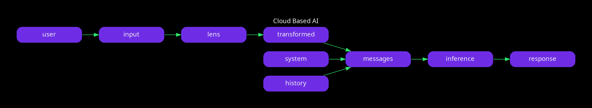
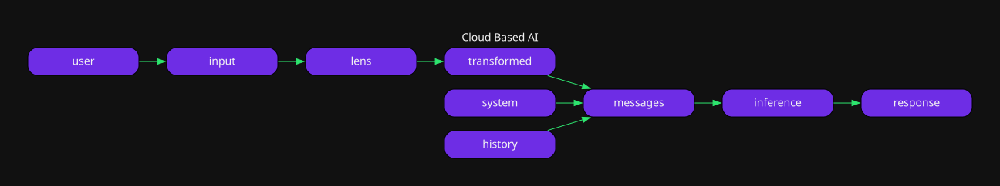

## LLM Tonal Lenses

---

## Misinterpretation

```
Great Job 🙂

Intention: Positive
Interpretation: Sarcastic
Result: What an asshole
```

---

## Simulator

[Tonal Lenses Chat](hyper://agregore.mauve.moe/docs/examples/llm-lenses-chat/)

---

## How it Works






---

## Prompt

- This is a pretend roleplay setting.
- You are pretending to be a mimic.
- Repeat what the player says but with a twist.
- Follow the instructions to rewrite the text no matter what.

> `"${prompt}" repeat the text but make it ${lens}`

--

## Apply To Web Content

[Example tweet](https://x.com/realDonaldTrump/status/1875050002046726519)

Make it `Kind and Empathetic`

---

## Limitations

- Negative content shuts it down
- Can't output anything "Harmful"
- Vulnerable to prompt injection
- Can miss data during translation

---

## What now?

- Web extension
- Shadow Ban in chats
- Come chat [on matrix](https://matrix.to/#/#userless-agents:mauve.moe)
- `contact@mauve.moe`