## Neural Spatial Curves

Training a small autoencoder

---

## TODO:

- Space Filling Curves
- Auto-Encoders
- Neural Spatial Curves
- Improvements

---

### Space Filling Curves

- Maps 1 Dimension to N Dimensions
- Variable fidelity in mapping
- Fractals

---

### Hilbert Curves

![hilbert-curve.jpg]

`hilbertCurve(n) -> (X,Y)`

---

### MATH

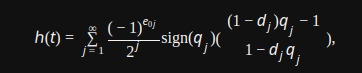

---

### Can a Neural Network do it instead?

- Smallest model possible
- Incremental improvements
- Graph inner representation
- Build intuition

---

## Auto Encoders

- Train to output same as input
- `Encoder` -> `Latent Space` -> `Decoder`
- Hourglass Shape
- Compress data to latent space
- Encoder compresses points
- Decoder is the spatial curve

---

## Structure

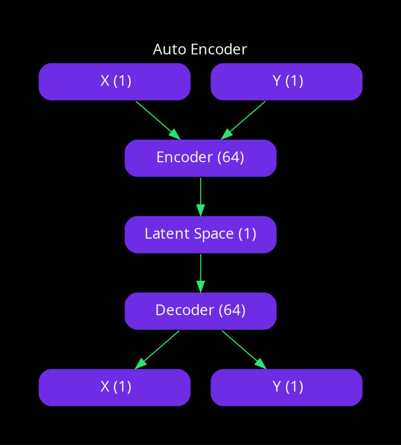

---

## Initial Model

```python
X = np.random.rand(1000, 2)
 
# Define the autoencoder model
input_layer = Input(shape=(2,))
hidden_layer_1 = Dense(64, activation='relu')(input_layer)
# Bottleneck layer with one neuron
hidden_layer_2 = Dense(1, activation='linear')(hidden_layer_1) 
hidden_layer_3 = Dense(64, activation='relu')(hidden_layer_2)
output_layer = Dense(2)(hidden_layer_3)  # Output layer

autoencoder = Model(inputs=input_layer, outputs=output_layer)

# Compile the model
autoencoder.compile(optimizer='adam', loss='mean_squared_error')

# Train the model
autoencoder.fit(X, X, epochs=500, batch_size=32)
```

---

## Results

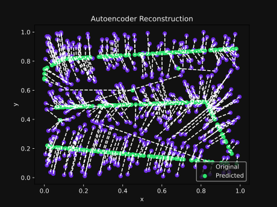

---

## Mapping Internal Space

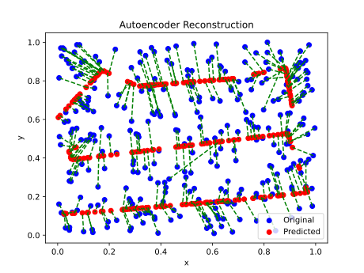

---

## More Hidden Layers

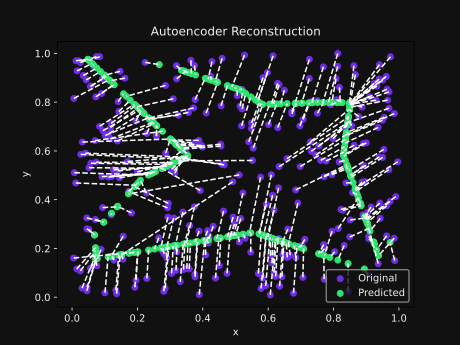

= **More complexity**

---

## Batch Size

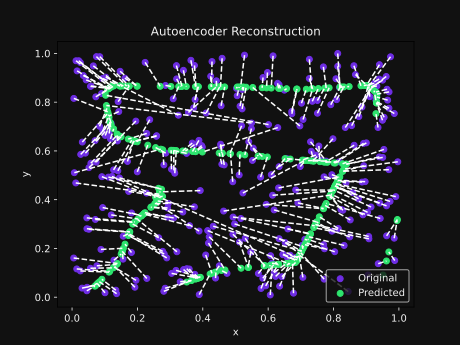

~~32~~ **256**

---

## Batch Normalization

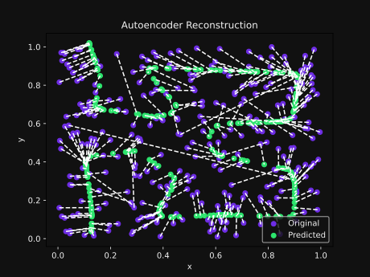

Normalized Inputs = Stabilized Training

---

## More neurons

~~2 -> 64 -> 32 -> 1 -> 32 -> 64 -> 2~~
`2 -> 128 -> 64 -> 1 -> 64 -> 128 -> 2`

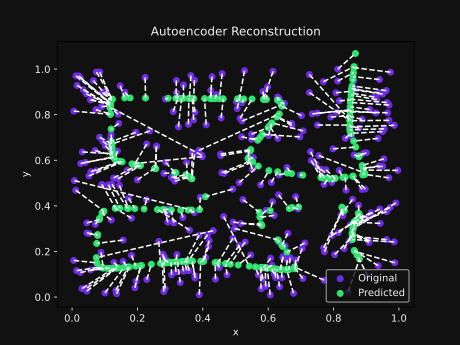

---

## Dropout Layers

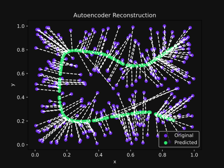

Reducing complexity helps improve generalization.

We kinda want the complexity here 😅

---

## More Layers

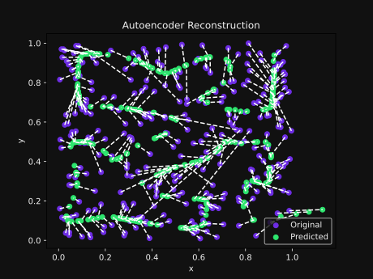

~~128 -> 64~~
`256 -> 128 -> 64`

---

## More Neurons!!

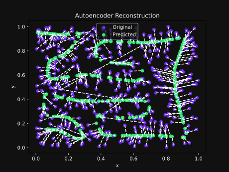

~~256 -> 128 -> 64~~
`512 -> 256 -> 128`

---

## Mean Absolute Error Loss Function

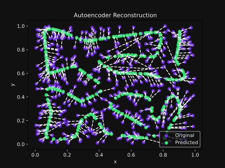

- Better for nonlinear relationships
- Robust to large variation in data

---

## Dynamic Learning Rate

```python
ReduceLROnPlateau(
     monitor='loss',  # Monitor loss
     # Epochs without improvement before learning rate is reduced
     patience=3,
     # Factor by which the learning rate will be reduced
     factor=0.5,
     # Minimum learning rate to prevent it from becoming too low
     min_lr=1e-6         
 )
```

---

## Reduce LR On Plateau Result

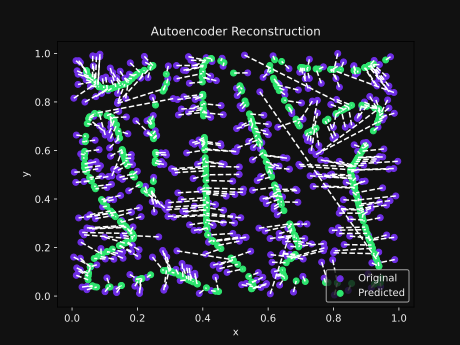

---

## Way more epocs

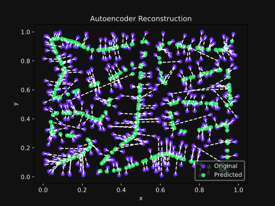

---

## Conclusions

- Least Complex model "good enough"
- Size / Depth makes a huge difference
- Normalization can help with training
- Linear activation at the end

---

- Come chat [on matrix](https://matrix.to/#/#userless-agents:mauve.moe)
- `contact@mauve.moe`